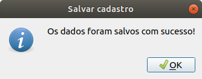

# Registro-de-focos
O Registro de focos tem como principal objetivo cadastrar os bairros da cidade e os focos de dengue encontrados em cada um deles.A figura abaixo apresenta a tela inicial da aplicação.

Ademais, o aplicação apresenta uma janela para estatísticas, na qual são apresentados a "Média de focos" encontrados e consequentemente os bairros classisificados com maior e menor risco.

# Inserção dos dados

Os dados necessários para a aplicação são o nome do bairro e número de focos registrados naquele local. É necessário preencher os Line Edit representados pelos labels (Bairro e Quantidade de Focos).E logo após isso o botão inserir irá atualializar a tabela e classificar o nível de risco de cada bairro cadastrado.

A classificação de risco dos bairros foi  estabelecida em Alto(cor vermelha) para bairros que fossem registrados mais que 50 focos de dengue,Médio(cor azul) para bairros que portassem entre 20 e 50 focos de dengue e para bairros com menos de 20 focos foi atribuido risco Baixo(cor verde).

# Ordenação dos dados

Na aplicação foram estabelecidos dois tipos de ordenação : a opção de ordenar por ordem alfabética(Push Button- Ordenar por nome) ou ordenar pela quantidade de focos encontrados( do menor para maior)-(Push Button - Ordenar por quantidade).

# Armazenamento dos dados

Ao acessar a opção do "Menu" na borda superior da interface o usuário tem a opção de armazenar os dados cadastrados ou carregar dados de um arquivo já pronto. Sendo válido destacar que ao carregar os dados as estatísticas já seram atualizadas na aplicação.

